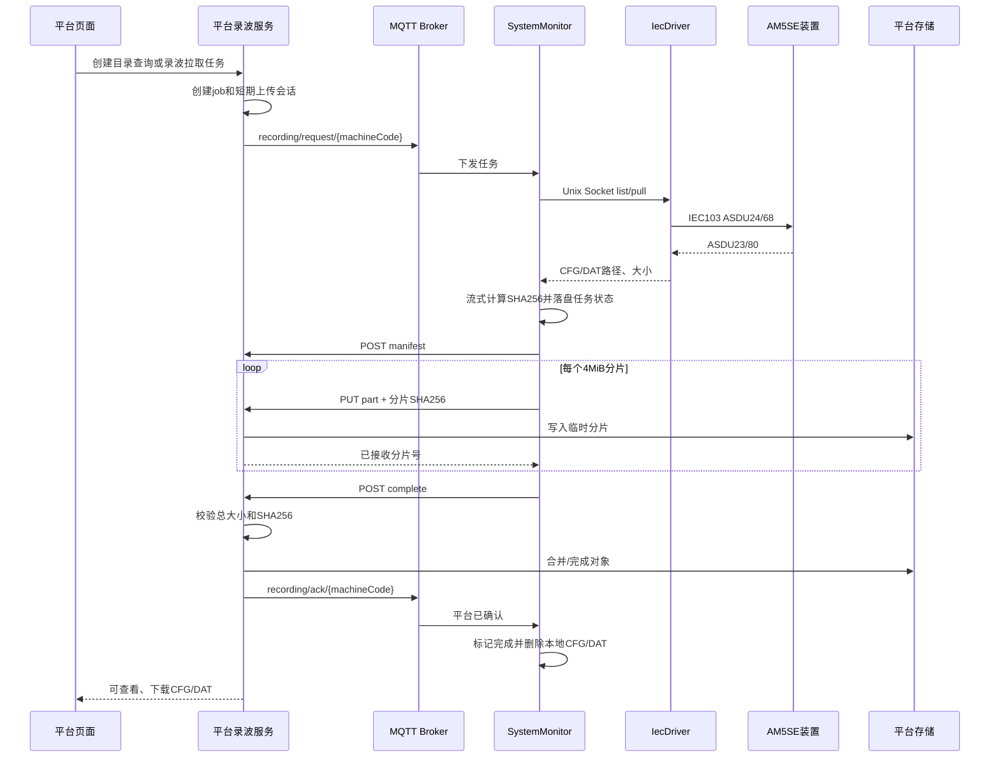

# IEC103 录波文件上送平台设计

## 1. 目标与边界

AM5SE IEC103 网口可以从保护装置拉取 COMTRADE `CFG/DAT` 文件。本设计解决文件如何从边端可靠传到平台，覆盖外网、4G 断线、重复任务、边端重启和大文件重传。

本设计只处理网口 IEC103，不增加串口路径。协议驱动继续只负责装置通信和本地文件生成，不直接访问平台。

## 2. 结论

采用两条链路：

- **MQTT 控制面**：下发目录查询/录波拉取任务，返回任务状态和上传结果。
- **HTTPS 数据面**：使用平台签发的短期、单任务上传令牌，按固定大小分片上传 CFG/DAT。

不使用 MQTT 承载录波二进制。64 MiB DAT 经过 Base64 后约为 85 MiB，在当前约 48 KiB MQTT 消息上限下需要约 1800 条消息，会放大流量、Broker 压力和失败恢复成本。

第一版数据上传经过平台 API，由平台存储适配层写入本地持久化目录。后续启用 MinIO 时，可以在不改变 MQTT 任务模型的前提下，把数据面切换为预签名分片直传。

## 3. 组件职责

| 组件 | 职责 |
| --- | --- |
| `IecDriver` | 保持 AM5SE TCP 1048 常驻连接，查询录波目录，拉取 CFG/DAT，校验 IEC103 分包并写入本地文件 |
| IEC103 本地命令端点 | 在常驻进程内执行 `list`/`pull`，避免为了拉录波停止驱动并抢占 TCP 监听端口 |
| `SystemMonitor` 录波传输任务 | 接收 MQTT 任务、调用本地命令端点、计算 SHA256、维护本地任务队列、执行 HTTPS 分片上传 |
| 平台录波服务 | 创建任务和短期令牌、发布 MQTT 请求、接收分片、校验文件、维护元数据和下载权限 |
| 存储适配层 | 通过 `RecordingStorage` 隔离存储实现；当前实现为 `local`，MinIO 作为后续适配器 |

`IecDriver` 不发布 MQTT，也不持有平台 Token；平台传输失败不会阻塞保护装置采集。

## 4. 完整流程



## 5. MQTT 主题

基础主题继续按 `machineCode` 追加作用域：

| 配置字段 | 默认主题 | 方向 |
| --- | --- | --- |
| `recordingRequestTopic` | `edge/recording/request` | 平台到边端 |
| `recordingReplyTopic` | `edge/recording/reply` | 边端到平台 |
| `recordingStatusTopic` | `edge/recording/status` | 边端到平台 |
| `recordingAckTopic` | `edge/recording/ack` | 平台到边端 |

目录查询请求：

```json
{
  "requestId": "REC_20260729170000001",
  "action": "list",
  "machineCode": "COMM202600102",
  "deviceCode": "AM5SE_T_01",
  "ts": 1785315600000
}
```

拉取请求由平台同时签发上传会话：

```json
{
  "requestId": "REC_20260729170000002",
  "action": "pull",
  "machineCode": "COMM202600102",
  "deviceCode": "AM5SE_T_01",
  "fan": 15,
  "upload": {
    "sessionId": "01JXYZ...",
    "baseUrl": "https://edge.kyxn.net/api/edge-recording-uploads/01JXYZ...",
    "token": "一次性随机令牌",
    "expireAtMs": 1785317400000,
    "partSize": 4194304
  },
  "ts": 1785315600000
}
```

拉取任务的边端状态阶段固定为：

`accepted -> device_connecting -> pulling_cfg -> pulling_dat -> local_ready -> uploading -> verifying -> completed`

目录查询在 `device_connecting` 后进入 `pulling_directory -> completed`。平台内部还使用
`completed_ack_pending` 表示文件已经校验完成、但完成 ACK 暂时未能发布；该状态不由边端产生。

失败状态使用 `failed`，并带 `retryable`、`errorCode`、`message`。每条状态包含 `requestId/machineCode/deviceCode/fan/ts`，便于平台幂等更新。

## 6. 边端本地命令端点

常驻 `IecDriver` 为每个设备配置创建 Unix Domain Socket：

```text
/run/modbus-gateway/iec103/<设备配置文件名>.sock
```

可以通过 `protocol.iec.recordingCommandSocket` 显式覆盖路径。Socket 创建后权限为 `0660`；
系统存在 `gateway` 组时将组归属设置为 `gateway`，权限设置失败则驱动拒绝启动该命令端点。

只接受本机 `root/gateway` 用户，命令只有：

- `list`：返回录波目录，不写文件。
- `pull fan=<n>`：拉取指定 FAN，输出到配置中的 `recordingDirectory`。
- `status requestId=<id>`：查询正在执行的本地任务。

端点不接受任意输出路径，避免平台请求造成路径穿越。`SystemMonitor` 根据 `deviceCode` 查运行配置和 socket，不允许平台直接指定配置文件路径。

实际线协议为 UTF-8、制表符分隔、换行结尾的版本化单行帧；字符串字段使用百分号转义：

```text
V1\tLIST\t<requestId>\n
V1\tPULL\t<requestId>\t<FAN>\n
V1\tSTATUS\t<requestId>\n
```

响应以 `V1\tSTATUS` 开头，包含 `requestId/action/stage/retryable/FAN`、CFG/DAT
路径与大小、错误信息及目录记录。单帧上限 8 KiB，待执行任务最多 32 个，最多保留 128 个
已完成状态。相同 `requestId` 和相同参数幂等返回；复用 `requestId` 提交不同命令会被拒绝。

## 7. HTTPS 分片接口

平台管理接口和设备上传接口分开：

| API | 用途 |
| --- | --- |
| `POST /api/recordings/jobs` | 平台用户创建目录查询/拉取任务 |
| `GET /api/recordings` | 查询录波记录和任务状态 |
| `GET /api/recordings/{id}/download` | 获取短期下载地址或受控下载流 |
| `POST /api/edge-recording-uploads/{sessionId}/manifest` | 边端提交 CFG/DAT 名称、大小、SHA256 |
| `GET /api/edge-recording-uploads/{sessionId}/parts` | 边端重启或断线后查询已接收分片 |
| `PUT /api/edge-recording-uploads/{sessionId}/files/{kind}/parts/{partNo}` | 上传一个分片，`kind` 只能是 `cfg/dat` |
| `POST /api/edge-recording-uploads/{sessionId}/complete` | 请求平台校验并完成记录 |

设备上传接口只认会话令牌，不使用平台管理员 Token。令牌绑定 `machineCode + deviceCode + FAN + sessionId`，默认 30 分钟失效。

分片请求必须带：

- `Content-Length`
- `Content-Range`
- `X-Part-SHA256`
- `Authorization: RecordingUpload <token>`

默认分片 4 MiB，最后一片可小于 4 MiB。单文件上限继续使用 IEC103 配置的 64 MiB，平台还要独立校验，不能信任边端声明。

## 8. 文件和元数据

CFG 与 DAT 分开存储，但必须归属同一个 `recordingId`。对象路径由平台生成：

```text
recordings/<machineCode>/<deviceCode>/<yyyy>/<MM>/<dd>/<recordingId>/FAN00015.CFG
recordings/<machineCode>/<deviceCode>/<yyyy>/<MM>/<dd>/<recordingId>/FAN00015.DAT
```

平台至少保存：

- `recordingId/requestId/machineCode/deviceCode/FAN`
- 装置录波时间、平台请求时间、边端完成时间
- CFG/DAT 文件名、大小、SHA256、存储对象键
- 上传状态、失败原因、重试次数
- 当前任务创建时间和完成时间

当前版本尚未保存请求用户和下载审计记录；这两项属于平台后续审计能力，不能用现有任务表代替。

当前实现以 `requestId/recordingId/sessionId` 三个唯一键保证任务和上传会话幂等。后续业务去重再增加
`machineCode + deviceCode + FAN + 装置录波时间`；装置时间缺失时应增加 CFG/DAT SHA256，防止 FAN 循环复用造成误判。

## 9. 断线续传和清理

`SystemMonitor` 将所有未完成任务写入单个版本化队列：

```text
/opt/modbus-gateway/data/iec103-recording-upload-queue.tsv
```

队列当前格式为 `V1` TSV，每行保存请求、上传会话、短期 Token、Socket、阶段、CFG/DAT
路径/大小/SHA256、重试次数和下次执行时间。字符串使用百分号转义；文件通过同目录临时文件原子
替换并设置为 `0600`。Token 不进入进程参数，调用 `curl` 时通过临时 `0600` Header 文件传递。

恢复规则：

1. 边端重启后扫描未完成任务。
2. 上传令牌仍有效时查询平台已接收分片，只补缺片。
3. 本地命令进程重启导致 `REQUEST_NOT_FOUND` 时，以相同 `requestId` 重新提交 `list/pull`。
4. 令牌失效时任务进入不可自动重试的 `failed`；当前版本尚未实现续签，需由平台重新创建任务。
5. 只有收到平台 `completed` ACK 后才删除本地 CFG/DAT。ACK 即使早于 `/complete` HTTPS
   响应到达也会被接受，避免永久停留在 `awaiting_ack`。
6. 完成后保留最多 128 条不含 Token、上传 URL 和文件路径的 `requestId` 墓碑；QoS 重投相同
   请求时直接幂等返回 `completed`，不会访问已经清理的本地文件。

实际重试为指数退避，默认从 5 秒开始并封顶 300 秒。每次重试先查询平台已有分片，所以已经
成功的分片不会重传。当前尚未实现边端录波总空间上限、保留天数和 Token 续签，这三项必须在
启用自动录波扫描前补齐；人工按 FAN 拉取不受影响。

## 10. 安全约束

- 平台同时校验 MQTT topic 末段、payload 和任务记录中的 `machineCode`，三者必须一致。
- 上传令牌至少 256 bit 随机数，数据库只保存哈希。
- 上传会话只能写平台预先生成的对象键，边端不能传目录路径。
- 文件名固定为 `FAN<数字>.CFG/.DAT`，平台拒绝路径分隔符和控制字符。
- 平台按声明大小、实际大小、分片 SHA256、完整文件 SHA256 四层校验。
- 下载使用平台权限和短期 URL，记录下载用户、时间和来源 IP。
- 边端不保存 MinIO AccessKey/SecretKey，也不调用新建 machine/meter 等高权限 API。
- 生产配置只允许 HTTPS，并使用系统 CA 正常校验证书；`allowInsecureHttp` 仅用于隔离测试。
- `SystemMonitor` 运行环境必须提供 `curl` 和 `sha256sum`。当前实现不静态链接 `libcurl`，以免
  扩大边端二进制；缺少任一命令时任务会失败并上报。

## 11. 当前实现与后续项

已实现：

1. 常驻 `IecDriver` Unix Socket `list/pull/status`，不会与 TCP 1048 监听抢占。
2. 平台任务、短期令牌、manifest/parts/complete、本地流式合并和受控下载。
3. `SystemMonitor` MQTT 控制、持久队列、断点续传、指数退避和 ACK 后清理。
4. Unix Socket 幂等/异步测试、边端重启恢复测试、ACK/HTTPS 竞态测试、错误 SHA/缺片测试及
   平台 64 MiB、4 MiB 分片恢复测试。

后续项：真实 AM5SE 装置与公网 HTTPS 端到端验收、平台进程中断恢复验收、空间配额/保留策略、
Token 续签和 MinIO 存储适配。

第一阶段先做平台人工拉取；自动上传通过 `autoUpload/recordingScanIntervalSec` 后续启用，默认关闭，避免保护装置产生大量录波时占满 4G 链路和平台存储。
