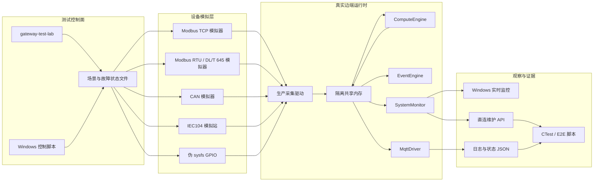
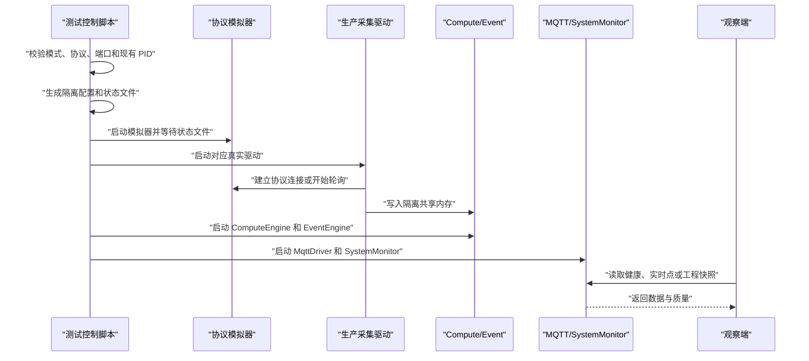

# 边端模拟测试整体设计报告

> 文档状态：基于当前代码实现整理<br>
> 更新日期：2026-08-09<br>
> 适用项目：Gateway-zk 边端运行时、新版 Windows 配置工具及相关协议驱动<br>
> 配套手册：[边端数据模拟与硬件在环测试](边端数据模拟与硬件在环测试.md)

## 1. 报告摘要

边端模拟测试系统的目标不是生成一批看起来正常的共享内存数据，而是在没有真实设备、需要稳定复现故障或进行版本回归时，用协议模拟设备驱动真实采集程序，验证从物理协议边界到上层应用的完整数据链路。

当前系统已经形成以下闭环：

```text
协议模拟器
  -> 真实协议传输或等价测试传输
  -> 生产采集驱动
  -> 隔离共享内存
  -> ComputeEngine / EventEngine
  -> MqttDriver / SystemMonitor
  -> Windows 客户端或自动验收脚本
```

当前成熟度可以定义为“协议与数据链路集成测试实验室”，能够承担驱动回归、故障注入、恢复验证、写回验证和 Windows 客户端联调。它还不是完整数字孪生平台，暂时不能替代真实设备兼容性测试、电气层硬件在环测试、EMS 闭环策略验收或长期可靠性试验。

## 2. 建设背景

边端系统同时涉及串口、网络、CAN、DIDO、共享内存、计算规则、事件、MQTT、直连维护和 Windows 配置工具。只测试单个协议编解码函数，无法发现以下问题：

1. 驱动配置可以解析，但真实采集调度没有运行。
2. 协议读到了值，但缩放、质量、时间戳或 `index` 错误。
3. 单个从站故障阻塞整条链路，退避和恢复策略不符合预期。
4. 写入请求已接收，但未到达设备，或者写后校验结果不正确。
5. 共享内存有值，但 ComputeEngine、EventEngine、MqttDriver 或 SystemMonitor 无法解释。
6. 边端运行正常，但 Windows 客户端看不到中文名称、质量或写入结果。
7. 测试使用正式 machineCode、正式共享内存或正式端口，污染生产环境。

因此测试系统必须覆盖“协议输入、真实驱动、内部数据总线、上层服务、外部观察”五层，而不是停留在单元测试或直接写共享内存。

## 3. 设计目标与非目标

### 3.1 设计目标

- 使用与生产相同的采集驱动、配置加载器、共享内存和上层服务。
- 在无真实设备时稳定生成可预测、可变化和可越界的数据。
- 按设备或从站注入超时、断连、协议异常、写超时和写后校验失败。
- 验证故障隔离、坏质量传播、退避、恢复探测和写回闭环。
- 同时支持纯软件、跨主机软件模拟和硬件在环三种拓扑。
- 输出机器可判定的测试结果，并保留足够的日志和状态证据。
- 与正式运行环境强制隔离，测试停止后不残留进程、端口和共享内存。

### 3.2 非目标

- 不模拟真实设备全部内部控制算法。
- 不证明 USB-RS485、CAN 收发器、GPIO 电气特性和抗干扰能力。
- 不直接在生产 machineCode 下生成模拟数据。
- 不以共享内存直接注值替代协议链路测试。
- 不把测试实验室作为常驻生产服务或出厂默认服务。
- 当前不承担完整 EMS、AGC/AVC、PCS/BMS 能量闭环仿真。

## 4. 核心设计原则及理由

### 4.1 协议端生成数据

主验收链路必须由模拟器发出协议帧，再由真实驱动采集。这样才能同时验证帧格式、超时、重试、批量读取、调度、退避、缩放和质量处理。

直接写共享内存只适合针对 ComputeEngine、EventEngine、MQTT 或画面的局部测试，不应作为驱动通过验收的证据。

### 4.2 使用生产二进制

模拟器是测试专用程序，采集驱动和上层服务必须来自待发布版本。否则测试通过只能说明模拟版本可用，不能说明发布版本可用。

安装脚本会优先使用 `/opt/modbus-gateway/test-lab/bin` 中本次构建的驱动。当前启动脚本仍保留向 `/opt/modbus-gateway/bin` 回退的兼容逻辑，正式发布门禁应增加严格模式，禁止在未声明时借用生产目录二进制。

### 4.3 确定性优先

`normal`、`ramp`、`random`、`boundary` 场景均由时间、地址和从站号确定。`random` 是可重复的伪随机变化，不依赖外部随机源。自动测试因此可以复现同类输入，而不是依赖偶然数据。

### 4.4 故障按设备隔离

故障状态按从站或设备保存，允许只中断第二个从站，同时继续观察第一个和第三个从站。这是验证单设备故障不能拖垮整条链路、退避策略是否有效的基础。

### 4.5 控制面与数据面分离

场景和故障通过独立状态文件控制，协议数据仍走真实传输链路。状态文件采用临时文件加原子替换，模拟器在后续请求或发送周期中重新读取，避免为了改变场景重启全部服务。

### 4.6 分层验收

测试从编解码单元测试逐步上升到完整进程链路、Windows 联调和真实接口硬件在环。低层测试速度快、定位准确，高层测试覆盖真实集成风险，两者不能互相替代。

## 5. 总体架构



### 5.1 数据面

数据面负责模拟协议报文、真实驱动采集、共享内存存储、派生计算、事件扫描、MQTT 输出和实时快照。任何值都应能从模拟输入追踪到最终输出。

### 5.2 控制面

控制面负责启动、停止、切换场景、注入故障、恢复设备和覆盖固定值。控制命令不会直接修改驱动内部状态，而是修改模拟设备的外部行为。

### 5.3 证据面

证据面包括模拟器计数器、各进程日志、共享内存实时点、SystemMonitor API、MQTT 输出和自动脚本退出码。测试结果必须至少包含输入动作、边端结果和判定结论。

## 6. 部署拓扑

### 6.1 纯软件单机模式

模拟器和边端运行时位于同一台 Linux 主机：

- Modbus TCP、IEC104 使用回环 TCP。
- Modbus RTU、DL/T 645 使用 PTY 对。
- CAN 使用测试专用 UDP 双向传输。
- DIDO 使用伪 sysfs 目录。

该模式适合 CI、驱动回归、故障恢复和写回测试。它不验证实体接口、电气接线和硬件时序。

### 6.2 跨主机软件模式

Windows 或另一台 Linux 主机运行模拟器，边端运行真实驱动：

- 网络协议通过实体以太网连接。
- CAN 可使用 UDP 测试传输跨主机验证帧内容和双向写入。
- 串口可通过 USB-RS485 与边端串口交叉连接。

该模式增加了操作系统、网卡、路由和跨主机时延，但 UDP CAN 仍不等同于实体 CAN。

### 6.3 硬件在环模式

边端使用真实 `/dev/ttySPx`、`can0/can1`、GPIO 和实体网口，测试侧使用 USB-RS485、USB-CAN、继电器工装或协议测试仪。

该模式用于发布前接口验收，重点检查波特率、校验位、终端电阻、接线、收发器和驱动恢复行为。

### 6.4 生产现场禁止项

- 不以正式 machineCode 启动测试。
- 不绑定正式 MQTT broker，除非使用明确隔离的测试租户和 topic。
- 不复用正式共享内存名称。
- 不覆盖正式设备配置。
- 不在 EMS 正执行功率控制时注入高风险控制命令。

## 7. 模块边界

| 模块 | 主要职责 | 当前实现位置 |
| --- | --- | --- |
| `gateway-test-lab-sim` | 协议模拟、状态加载、统计输出 | `test-lab/src/main.cpp` |
| Modbus TCP 模拟器 | 功能码处理、值模型、故障注入 | `test-lab/src/modbus_simulator.cpp` |
| 串口模拟器 | Linux PTY、Windows COM、RTU 和 645 帧处理 | `test-lab/src/serial_simulator.cpp` |
| CAN 模拟器 | SocketCAN/UDP 测试传输、周期帧和写帧接收 | `test-lab/src/can_simulator.cpp` |
| IEC104 模拟站 | 启动链路、总召、周期数据、命令确认 | `test-lab/src/iec104_simulator.cpp` |
| Linux 编排脚本 | 配置渲染、进程生命周期、故障控制和清理 | `test-lab/scripts/gateway-test-lab.sh` |
| Windows 控制脚本 | Windows 模拟器启动、场景和故障控制 | `test-lab/scripts/Gateway-TestLabSimulator.ps1` |
| 结果查看脚本 | 直连 API 实时点筛选和刷新 | `test-lab/scripts/Show-GatewayTestLabResults.ps1` |
| 配置模板 | 独立 machineCode、点表、共享内存和服务配置 | `test-lab/templates/` |
| 自动验收 | 单元、端到端和 Windows 包冒烟测试 | `test-lab/tests/` |

## 8. 协议覆盖与能力边界

| 协议/模块 | 当前模拟能力 | 已验证内容 | 明确边界 |
| --- | --- | --- | --- |
| Modbus TCP | `01/02/03/04/05/06/0F/10`，多从站，读写保持 | 批量读取、单多点写、异常、恢复、写后校验 | 不模拟厂商私有功能码 |
| Modbus RTU | PTY/COM，CRC，常用读写功能码 | 串口参数、读写、异常、恢复 | PTY 不验证 RS485 电气层和方向控制 |
| DL/T 645-2007 | 地址、校验、常用 DI 读取和写入回读 | 电压等常用数据项、异常、恢复 | 不是完整电表型号库，不覆盖全部冻结和事件数据 |
| CAN | 扩展帧遥测、UDP 双向帧、SocketCAN | 周期帧、停帧、恢复、写帧接收 | 当前为通用测试帧，不代表所有厂家 CAN 协议 |
| DIDO | 伪 sysfs 输入输出文件 | DI 切换、DO 文件写入、文件异常 | 不验证电气隔离、干湿接点和继电器寿命 |
| IEC104 | STARTDT、总召、单点、浮点遥测、遥控和时钟类命令确认 | 链路启动、周期数据、select/execute 路径、断连恢复 | 未覆盖完整原因码、所有类型标识和大规模站表 |
| ComputeEngine | 一个源点二倍派生规则 | 跨进程读取、输出和质量传播 | 尚未覆盖复杂 EMS 模块图 |
| EventEngine | 真实扫描进程 | 数据变化链路不阻塞 | 当前实验室未定义完整告警矩阵 |
| MQTT | 全量快照，默认 stdout | machineCode、点数和周期输出 | 尚未系统覆盖断线缓存和大规模续传 |
| SystemMonitor | 健康、实时点、工程快照、控制入口 | Win 监控和自动 API 验收 | 仅限测试端口和测试工程 |

尚未纳入常驻实验室的协议包括 IEC103 串口、AM5SE IEC103 网口录波、IEC104 文件传输及其他厂商私有文件业务。这些能力仍由各自的协议单元或集成测试验证。

## 9. 场景与数据模型

### 9.1 场景模型

| 场景 | 数据行为 | 主要用途 |
| --- | --- | --- |
| `normal` | 稳定基值、心跳和有限变化 | 连通性、缩放、名称和基线验证 |
| `ramp` | 随时间递增或周期变化 | 刷新频率、曲线连续性、变化上报 |
| `random` | 可重复伪随机变化 | 多值覆盖、事件压力和异常值组合 |
| `boundary` | 在最小值和最大值之间切换 | 数据类型边界、缩放、溢出和画面量程 |

### 9.2 固定值覆盖

控制状态支持按 `slave + area + address` 覆盖 Modbus 值。覆盖优先于场景生成，可用于验证特定寄存器、写后读取和已知业务值。

### 9.3 标识规划

| 项目 | 测试值 |
| --- | --- |
| machineCode | `SIM_COMM202600999` |
| meterCode | `SIM_*` |
| 测试点 index | 主要位于 `910000` 至 `999901` |
| 派生点 | `SIM_COMPUTE_DOUBLE / 999901` |
| SystemMonitor 端口 | `19443` |
| Modbus TCP 端口 | `15020` |
| IEC104 示例端口 | `12404` |
| CAN UDP 端口 | 驱动 `19011`，模拟器 `19012` |

测试编码单独规划的原因是防止正式配置误订阅、平台误归档和共享内存路由冲突。

## 10. 故障模型

### 10.1 通用故障

| 故障模式 | 模拟行为 | 期望边端结果 |
| --- | --- | --- |
| `timeout` | 延迟或不响应 | 超时计数增加，达到阈值后坏质量和退避 |
| `disconnect` | 主动关闭连接 | 驱动进入重连，其他设备不被永久阻塞 |
| `exception` | 返回协议异常或抑制有效数据 | 错误可定位，不能当作正常值 |
| `write-timeout` | 只让写请求超时 | 读链路继续，写结果明确失败 |
| `write-verify-failed` | 接收写请求但不保留写值 | 写后校验失败，不能返回成功 |

### 10.2 协议差异

- Modbus 能区分读超时、断连、异常、写超时和写后校验失败。
- CAN 当前将设备故障表现为停止周期帧，重点验证离线判定和恢复。
- IEC104 的 `disconnect` 会断开连接，其他非正常状态会抑制周期数据或响应。
- DIDO 通过值文件切换或文件失效模拟输入变化和访问异常。

### 10.3 恢复验证

恢复不是只检查“重新有数据”，还必须验证：

1. 恢复探测发生在配置允许的轮次内。
2. 点质量从 `0` 恢复为 `1`。
3. 时间戳重新推进。
4. 同链路其他设备在故障期间持续采集。
5. 写队列没有因旧请求堵塞。
6. MQTT 和 Win 端能看到恢复后的新值。

## 11. 启停与运行时流程

### 11.1 启动流程



### 11.2 停止流程

停止顺序与数据流相反：SystemMonitor、MqttDriver、EventEngine、ComputeEngine、采集驱动、模拟器。脚本只终止 PID 文件指向且命令行包含测试根目录的进程，然后清除测试共享内存和伪 GPIO。

### 11.3 当前并发限制

当前编排脚本使用一组全局 PID 文件、控制状态和协议文件，因此一个实验室实例一次只运行一种采集协议。该限制有利于定位退避和恢复问题，但不能覆盖多协议并发资源竞争。

## 12. 配置生成与数据绑定

启动脚本根据协议选择模板，替换通信端点、端口、共享内存、计算源点和监测端口，生成独立运行配置。

每个协议模板同时定义：

- 设备与测点中文名称。
- `meterCode`、`pointCode` 和唯一 `index`。
- 读取周期、缩放、单位和写权限。
- 独立共享内存名称和 TTL。
- 退避、坏质量阈值和写后校验参数。

ComputeEngine、MqttDriver 和 SystemMonitor 使用同一设备配置和共享内存名称，保证派生点、实时点和全量上传对 `index` 的解释一致。

当前模板渲染使用受限占位符替换，并对部分输入字符进行校验。后续如增加复杂数组、厂家模板或多实例，应改为结构化 JSON 生成器，避免文本替换扩展困难。

## 13. 测试分层

| 层级 | 测试对象 | 当前实现 | 发现问题类型 |
| --- | --- | --- | --- |
| L1 编解码单元测试 | 模拟器与协议客户端 | C++ 测试目标 | CRC、功能码、字段、异常帧 |
| L2 模拟器进程测试 | `gateway-test-lab-sim` | C++ 测试和 Windows 冒烟 | 状态切换、端口、COM/UDP 行为 |
| L3 驱动端到端 | 模拟器到真实驱动和共享内存 | Shell E2E | 配置、采集、质量、退避、写回 |
| L4 服务链路 | Compute/Event/MQTT/SystemMonitor | `run_*_e2e.sh` | 跨进程路由、派生点、快照、全量 |
| L5 Windows 联调 | 新版 Windows 客户端 | 直连 19443 和结果脚本 | 名称、筛选、质量、写入交互 |
| L6 硬件在环 | 实体串口、CAN、GPIO、网口 | 人工或工装测试 | 接线、电气、硬件时序、收发器 |
| L7 现场试运行 | 真实设备和业务策略 | 独立验收 | 厂家兼容、长期运行、业务闭环 |

只有 L1 至 L5 通过，才能进入硬件在环；只有硬件在环通过，才能作为真实设备协议版本发布候选。

## 14. 当前自动化覆盖

### 14.1 CTest 目标

- `gateway_test_lab_modbus`
- `gateway_test_lab_serial`
- `gateway_test_lab_iec104`
- `gateway_test_lab_modbus_e2e`
- `gateway_test_lab_protocol_e2e`

### 14.2 端到端覆盖

当前 E2E 已验证：

- Modbus TCP 三从站实时点、单从站故障、恢复和固定值覆盖。
- Modbus RTU 数据、异常、恢复和写值读取。
- DL/T 645 数据、异常和恢复。
- DIDO 输入变化。
- IEC104 周期遥测、超时和恢复。
- CAN UDP 遥测、控制写帧接收、停帧和恢复。
- `SIM_COMPUTE_DOUBLE` 跨进程可见。
- MqttDriver 产生包含多个点的全量报文。
- SystemMonitor 健康、实时点和工程拉取。
- 测试停止后共享内存清理。

### 14.3 Windows 包冒烟

Windows 冒烟测试校验包内 SHA256，并验证 Modbus TCP 读取、值覆盖、异常恢复及虚拟 CAN 双向帧。它验证 Windows 分发包可运行，但不替代边端全链路测试。

## 15. 关键测试用例

### 15.1 P0 发布阻断用例

1. 每个已支持协议至少一个正常采集点达到 `quality=1`。
2. Modbus 第二从站超时期间，第一和第三从站继续更新。
3. 恢复后点质量和时间戳在预期轮次内恢复。
4. 可写点只在 `write.enable=true` 时执行。
5. 写后校验失败必须返回失败，不能只依据协议应答判定成功。
6. CAN 控制写入必须增加模拟器接收帧计数。
7. Compute 派生值正确，源点坏质量时输出质量同步变坏。
8. MqttDriver 全量报文包含测试 machineCode 和有效点。
9. SystemMonitor 能返回完整配置点，即使部分点尚未收到实时值。
10. 停止后无测试进程、监听端口和共享内存残留。

### 15.2 P1 稳定性用例

- 连续故障与恢复循环。
- `normal/ramp/random/boundary` 热切换。
- 高频写入和读写并发。
- 多从站不同故障组合。
- MQTT 断线、重连和缓存重放。
- SystemMonitor 工程大分片拉取。
- 运行数小时后的内存、CPU、文件描述符和日志增长。

### 15.3 P2 扩展用例

- 多协议实例并发。
- EMS 充放电闭环设备组。
- AGC/AVC 功率分配和限幅闭环。
- IEC103 录波文件生成、传输、确认和续传。
- 厂家协议录制报文回放。

## 16. 时延与性能观测设计

完整控制或采集链路应拆成以下时间段：

```text
T1 模拟器生成报文
T2 驱动收到并解析报文
T3 写入共享内存
T4 Compute/Event 完成处理
T5 MQTT 或 SystemMonitor 读取
T6 Windows/平台收到并展示
```

需要计算：

- 采集时延：`T3 - T1`
- 内部处理时延：`T5 - T3`
- 端到端展示时延：`T6 - T1`
- 写入设备时延：设备确认时间减边端接收时间
- 总控制时延：Win 发起时间到边端返回完成时间

当前实现已有模拟器收发计数、点位时间戳、写入阶段耗时、服务日志和实时 API，但缺少统一 `traceId` 和自动汇总报告。现阶段时延结论需要组合多个证据，后续应把统一追踪作为 P0 可观测性增强项。

性能测试不能只看平均值，还应输出 P50、P95、P99、最大值、超时数和丢帧数。低间隔场景还要记录 CPU、调度延迟、共享内存锁等待和 MQTT 队列长度。

## 17. 安全与隔离设计

| 隔离项 | 当前措施 | 仍需关注 |
| --- | --- | --- |
| machineCode | 固定 `SIM_COMM202600999` | 禁止改成正式编码 |
| 目录 | `/opt/modbus-gateway/test-lab` | 生产脚本不得扫描该目录 |
| 共享内存 | `gateway_test_lab_*` | 停止后必须清理 |
| 端口 | 独立 `15020/19443/12404/19011/19012` | 启动前检查占用 |
| MQTT | 默认禁用网络，仅 stdout | 启用时必须用测试 broker/topic |
| 进程 | 独立 PID 文件和命令行归属校验 | 增加严格二进制来源校验 |
| systemd | 不注册、不自启动 | 不进入出厂初始包 |
| 控制写入 | 仅模板声明可写点 | HIL 控制前需人工风险确认 |

## 18. 证据与测试报告格式

每次正式回归应至少保存以下内容：

1. 源码提交、构建时间、编译器和二进制 SHA256。
2. 运行模式、协议、端口、设备配置和场景。
3. 注入动作、目标设备、开始时间和恢复时间。
4. 模拟器请求、响应、读、写、故障和协议错误计数。
5. 关键点的 `index/meterCode/pointCode/value/quality/ts`。
6. 驱动、Compute、Event、MQTT、SystemMonitor 日志。
7. 测试用例结果、失败原因和清理结果。
8. HIL 模式下的接线、波特率、终端电阻和测试仪信息。

建议后续统一输出 `test-report.json` 和可阅读的 Markdown 摘要。JSON 用于持续集成门禁，Markdown 用于现场和版本审计。

## 19. 验收准则

### 19.1 功能通过

- 配置加载无错误，模拟器和所有选定服务正常启动。
- 正常点值、单位、缩放、名称、质量和时间戳正确。
- 写入权限、范围、协议响应和写后校验结果一致。
- Compute、Event、MQTT 和 SystemMonitor 能解释同一组点位。

### 19.2 故障通过

- 故障设备按阈值进入坏质量或离线。
- 同链路健康设备继续更新。
- 退避减少无效请求但保留恢复探测。
- 恢复后在配置轮次内重新采集，且没有旧写请求误执行。

### 19.3 隔离通过

- 没有正式 machineCode、正式 topic 或正式共享内存污染。
- 不覆盖生产配置和生产二进制。
- 停止后进程、端口、共享内存和伪 GPIO 全部清理。

### 19.4 发布判定

纯软件测试通过只能进入 HIL 阶段，不能直接证明真实设备兼容。新增或变更协议至少需要：协议单元测试通过、软件 E2E 通过、目标架构编译通过、真实接口 HIL 通过、现场设备抽样通过。

## 20. 当前问题与演进计划

### 20.1 P0

1. 增加统一测试报告和 `traceId`，自动统计端到端时延。
2. 增加严格二进制来源模式，禁止无提示回退到生产目录。
3. 增加 MQTT 断网、缓存、重连和断点续传自动测试。
4. 增加长时间稳定性测试及 CPU、内存、锁等待、文件描述符门限。
5. 让每次测试保存完整运行清单和二进制 SHA256。

### 20.2 P1

1. 支持多实验室实例和多协议并发，隔离 PID、端口、状态和共享内存。
2. 增加 EMS 闭环设备组，模拟 PCS、BMS、电表、温控、消防和 DIDO 联动。
3. 增加 AGC/AVC 额定功率、限幅、分配、反馈和超时闭环。
4. 增加网络抖动、丢包、乱序、限速和路由切换故障。
5. 增加设备断电、边端重启和策略状态恢复测试。

### 20.3 P2

1. 纳入 IEC103 和 AM5SE 录波文件全链路。
2. 建立厂家报文录制与脱敏回放库。
3. 为 USB-CAN 厂商 SDK 建立可插拔适配层。
4. 支持按厂家模板自动生成模拟设备和预期结果。
5. 与 Windows 客户端集成测试页面联动，一键启动、注入、观察和导出报告。

## 21. 结论

现有模拟测试系统的方向是合理的：它把模拟点放在协议边界之外，保留生产驱动和上层服务，因此能发现单纯共享内存注值无法发现的问题；同时通过独立 machineCode、目录、端口和共享内存降低了污染生产环境的风险。

当前系统已经适合日常驱动回归、退避与恢复验证、写入闭环验证、Windows 实时监控联调和基础发布门禁。下一阶段的重点不应继续堆叠孤立模拟点，而应补齐统一证据链、多协议并发、EMS/AGC-AVC 闭环、网络故障和录波文件链路，使它从“协议测试实验室”逐步升级为“边端系统级数字验证平台”。
