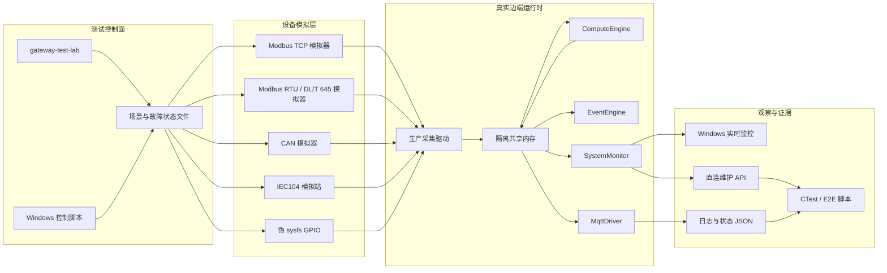
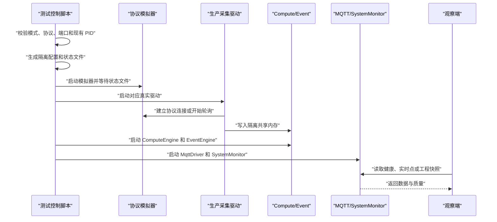

# 边端模拟测试整体设计报告

> 文档状态：基于当前代码实现整理  
> 更新日期：2026-08-11  
> 适用项目：Gateway-zk 边端运行时、新版 Windows 配置工具及相关协议驱动  
> 配套手册：[边端数据模拟与硬件在环测试](边端数据模拟与硬件在环测试.md)

## 1. 报告摘要

边端模拟测试系统的目标不是生成一批看起来正常的共享内存数据，而是在没有真实设备、需要稳定复现故障或进行版本回归时，用协议模拟设备驱动真实采集程序，验证从物理协议边界到上层应用的完整数据链路。

当前系统已经形成以下闭环：

```text
协议模拟器
  -> 真实协议传输或等价测试传输
  -> 生产采集驱动
  -> 隔离共享内存
  -> ComputeEngine / EventEngine
  -> MqttDriver / SystemMonitor
  -> Windows 客户端或自动验收脚本
```

当前成熟度可以定义为“协议与数据链路集成测试实验室”，能够承担驱动回归、故障注入、恢复验证、写回验证和 Windows 客户端联调。它还不是完整数字孪生平台，暂时不能替代真实设备兼容性测试、电气层硬件在环测试、EMS 闭环策略验收或长期可靠性试验。

## 2. 建设背景

边端系统同时涉及串口、网络、CAN、DIDO、共享内存、计算规则、事件、MQTT、直连维护和 Windows 配置工具。只测试单个协议编解码函数，无法发现以下问题：

1. 驱动配置可以解析，但真实采集调度没有运行。
2. 协议读到了值，但缩放、质量、时间戳或 `index` 错误。
3. 单个从站故障阻塞整条链路，退避和恢复策略不符合预期。
4. 写入请求已接收，但未到达设备，或者写后校验结果不正确。
5. 共享内存有值，但 ComputeEngine、EventEngine、MqttDriver 或 SystemMonitor 无法解释。
6. 边端运行正常，但 Windows 客户端看不到中文名称、质量或写入结果。
7. 测试使用正式 machineCode、正式共享内存或正式端口，污染生产环境。

因此测试系统必须覆盖“协议输入、真实驱动、内部数据总线、上层服务、外部观察”五层，而不是停留在单元测试或直接写共享内存。

## 3. 设计目标与非目标

### 3.1 设计目标

- 使用与生产相同的采集驱动、配置加载器、共享内存和上层服务。
- 在无真实设备时稳定生成可预测、可变化和可越界的数据。
- 按设备或从站注入超时、断连、协议异常、写超时和写后校验失败。
- 验证故障隔离、坏质量传播、退避、恢复探测和写回闭环。
- 同时支持纯软件、跨主机软件模拟和硬件在环三种拓扑。
- 输出机器可判定的测试结果，并保留足够的日志和状态证据。
- 与正式运行环境强制隔离，测试停止后不残留进程、端口和共享内存。

### 3.2 非目标

- 不模拟真实设备全部内部控制算法。
- 不证明 USB-RS485、CAN 收发器、GPIO 电气特性和抗干扰能力。
- 不直接在生产 machineCode 下生成模拟数据。
- 不以共享内存直接注值替代协议链路测试。
- 不把测试实验室作为常驻生产服务或出厂默认服务。
- 当前不承担完整 EMS、AGC/AVC、PCS/BMS 能量闭环仿真。

## 4. 核心设计原则及理由

### 4.1 协议端生成数据

主验收链路必须由模拟器发出协议帧，再由真实驱动采集。这样才能同时验证帧格式、超时、重试、批量读取、调度、退避、缩放和质量处理。

直接写共享内存只适合针对 ComputeEngine、EventEngine、MQTT 或画面的局部测试，不应作为驱动通过验收的证据。

### 4.2 使用生产二进制

模拟器是测试专用程序，采集驱动和上层服务必须来自待发布版本。否则测试通过只能说明模拟版本可用，不能说明发布版本可用。

安装脚本会优先使用 `/opt/modbus-gateway/test-lab/bin` 中本次构建的驱动。当前启动脚本仍保留向 `/opt/modbus-gateway/bin` 回退的兼容逻辑，正式发布门禁应增加严格模式，禁止在未声明时借用生产目录二进制。

### 4.3 确定性优先

`normal`、`ramp`、`random`、`boundary` 场景均由时间、地址和从站号确定。`random` 是可重复的伪随机变化，不依赖外部随机源。自动测试因此可以复现同类输入，而不是依赖偶然数据。

### 4.4 故障按设备隔离

故障状态按从站或设备保存，允许只中断第二个从站，同时继续观察第一个和第三个从站。这是验证单设备故障不能拖垮整条链路、退避策略是否有效的基础。

### 4.5 控制面与数据面分离

场景和故障通过独立状态文件控制，协议数据仍走真实传输链路。状态文件采用临时文件加原子替换，模拟器在后续请求或发送周期中重新读取，避免为了改变场景重启全部服务。

### 4.6 分层验收

测试从编解码单元测试逐步上升到完整进程链路、Windows 联调和真实接口硬件在环。低层测试速度快、定位准确，高层测试覆盖真实集成风险，两者不能互相替代。

## 5. 总体架构


```mermaid
flowchart LR
    subgraph Control["测试控制面"]
        CLI["gateway-test-lab"]
        WINCLI["Windows 控制脚本"]
        STATE["场景与故障状态文件"]
        CLI --> STATE
        WINCLI --> STATE
    end

    subgraph Device["设备模拟层"]
        MBTCP["Modbus TCP 模拟器"]
        SERIAL["Modbus RTU / DL/T 645 模拟器"]
        CAN["CAN 模拟器"]
        IEC["IEC104 模拟站"]
        GPIO["伪 sysfs GPIO"]
    end

    subgraph Runtime["真实边端运行时"]
        DRIVER["生产采集驱动"]
        SHM["隔离共享内存"]
        COMPUTE["ComputeEngine"]
        EVENT["EventEngine"]
        MQTT["MqttDriver"]
        MONITOR["SystemMonitor"]
    end

    subgraph Evidence["观察与证据"]
        WIN["Windows 实时监控"]
        API["直连维护 API"]
        LOG["日志与状态 JSON"]
        TEST["CTest / E2E 脚本"]
    end

    STATE --> MBTCP
    STATE --> SERIAL
    STATE --> CAN
    STATE --> IEC
    STATE --> GPIO
    MBTCP --> DRIVER
    SERIAL --> DRIVER
    CAN --> DRIVER
    IEC --> DRIVER
    GPIO --> DRIVER
    DRIVER --> SHM
    SHM --> COMPUTE
    SHM --> EVENT
    SHM --> MQTT
    SHM --> MONITOR
    COMPUTE --> SHM
    MONITOR --> WIN
    MONITOR --> API
    MQTT --> LOG
    API --> TEST
    LOG --> TEST
```

### 5.1 数据面

数据面负责模拟协议报文、真实驱动采集、共享内存存储、派生计算、事件扫描、MQTT 输出和实时快照。任何值都应能从模拟输入追踪到最终输出。

### 5.2 控制面

控制面负责启动、停止、切换场景、注入故障、恢复设备和覆盖固定值。控制命令不会直接修改驱动内部状态，而是修改模拟设备的外部行为。

### 5.3 证据面

证据面包括模拟器计数器、各进程日志、共享内存实时点、SystemMonitor API、MQTT 输出和自动脚本退出码。测试结果必须至少包含输入动作、边端结果和判定结论。

## 6. 部署拓扑

### 6.1 纯软件单机模式

模拟器和边端运行时位于同一台 Linux 主机：

- Modbus TCP、IEC104 使用回环 TCP。
- Modbus RTU、DL/T 645 使用 PTY 对。
- CAN 使用测试专用 UDP 双向传输。
- DIDO 使用伪 sysfs 目录。

该模式适合 CI、驱动回归、故障恢复和写回测试。它不验证实体接口、电气接线和硬件时序。

### 6.2 跨主机软件模式

Windows 或另一台 Linux 主机运行模拟器，边端运行真实驱动：

- 网络协议通过实体以太网连接。
- CAN 可使用 UDP 测试传输跨主机验证帧内容和双向写入。
- 串口可通过 USB-RS485 与边端串口交叉连接。

该模式增加了操作系统、网卡、路由和跨主机时延，但 UDP CAN 仍不等同于实体 CAN。

### 6.3 硬件在环模式

边端使用真实 `/dev/ttySPx`、`can0/can1`、GPIO 和实体网口，测试侧使用 USB-RS485、USB-CAN、继电器工装或协议测试仪。

该模式用于发布前接口验收，重点检查波特率、校验位、终端电阻、接线、收发器和驱动恢复行为。

### 6.4 生产现场禁止项

- 不以正式 machineCode 启动测试。
- 不绑定正式 MQTT broker，除非使用明确隔离的测试租户和 topic。
- 不复用正式共享内存名称。
- 不覆盖正式设备配置。
- 不在 EMS 正执行功率控制时注入高风险控制命令。

## 7. 模块边界

| 模块 | 主要职责 | 当前实现位置 |
| --- | --- | --- |
| `gateway-test-lab-sim` | 协议模拟、状态加载、统计输出 | `test-lab/src/main.cpp` |
| Modbus TCP 模拟器 | 功能码处理、值模型、故障注入 | `test-lab/src/modbus_simulator.cpp` |
| 串口模拟器 | Linux PTY、Windows COM、RTU 和 645 帧处理 | `test-lab/src/serial_simulator.cpp` |
| CAN 模拟器 | SocketCAN/UDP 测试传输、周期帧和写帧接收 | `test-lab/src/can_simulator.cpp` |
| IEC104 模拟站 | 启动链路、总召、周期数据、命令确认 | `test-lab/src/iec104_simulator.cpp` |
| Linux 编排脚本 | 配置渲染、进程生命周期、故障控制和清理 | `test-lab/scripts/gateway-test-lab.sh` |
| Windows 控制脚本 | Windows 模拟器启动、场景和故障控制 | `test-lab/scripts/Gateway-TestLabSimulator.ps1` |
| 结果查看脚本 | 直连 API 实时点筛选和刷新 | `test-lab/scripts/Show-GatewayTestLabResults.ps1` |
| 配置模板 | 独立 machineCode、点表、共享内存和服务配置 | `test-lab/templates/` |
| 自动验收 | 单元、端到端和 Windows 包冒烟测试 | `test-lab/tests/` |

## 8. 协议覆盖与能力边界

| 协议/模块 | 当前模拟能力 | 已验证内容 | 明确边界 |
| --- | --- | --- | --- |
| Modbus TCP | `01/02/03/04/05/06/0F/10`，多从站，读写保持 | 批量读取、单多点写、异常、恢复、写后校验 | 不模拟厂商私有功能码 |
| Modbus RTU | PTY/COM，CRC，常用读写功能码 | 串口参数、读写、异常、恢复 | PTY 不验证 RS485 电气层和方向控制 |
| DL/T 645-2007 | 地址、校验、常用 DI 读取和写入回读 | 电压等常用数据项、异常、恢复 | 不是完整电表型号库，不覆盖全部冻结和事件数据 |
| CAN | 扩展帧遥测、UDP 双向帧、SocketCAN | 周期帧、停帧、恢复、写帧接收 | 当前为通用测试帧，不代表所有厂家 CAN 协议 |
| DIDO | 伪 sysfs 输入输出文件 | DI 切换、DO 文件写入、文件异常 | 不验证电气隔离、干湿接点和继电器寿命 |
| IEC104 | STARTDT、总召、单点、浮点遥测、遥控和时钟类命令确认 | 链路启动、周期数据、select/execute 路径、断连恢复 | 未覆盖完整原因码、所有类型标识和大规模站表 |
| ComputeEngine | 一个源点二倍派生规则 | 跨进程读取、输出和质量传播 | 尚未覆盖复杂 EMS 模块图 |
| EventEngine | 真实扫描进程 | 数据变化链路不阻塞 | 当前实验室未定义完整告警矩阵 |
| MQTT | 全量快照，默认 stdout | machineCode、点数、周期、三类离线存储重启重放 | 大规模真实 broker 续传仍需独立压测 |
| SystemMonitor | 健康、实时点、工程快照、控制入口 | Win 监控和自动 API 验收 | 仅限测试端口和测试工程 |

尚未纳入常驻实验室的协议包括 IEC103 串口、AM5SE IEC103 网口录波、IEC104 文件传输及其他厂商私有文件业务。这些能力仍由各自的协议单元或集成测试验证。

## 9. 场景与数据模型

### 9.1 场景模型

| 场景 | 数据行为 | 主要用途 |
| --- | --- | --- |
| `normal` | 稳定基值、心跳和有限变化 | 连通性、缩放、名称和基线验证 |
| `ramp` | 随时间递增或周期变化 | 刷新频率、曲线连续性、变化上报 |
| `random` | 可重复伪随机变化 | 多值覆盖、事件压力和异常值组合 |
| `boundary` | 在最小值和最大值之间切换 | 数据类型边界、缩放、溢出和画面量程 |

### 9.2 固定值覆盖

控制状态支持按 `slave + area + address` 覆盖 Modbus 值。覆盖优先于场景生成，可用于验证特定寄存器、写后读取和已知业务值。

### 9.3 标识规划

| 项目 | 测试值 |
| --- | --- |
| machineCode | `SIM_COMM202600999` |
| meterCode | `SIM_*` |
| 测试点 index | 主要位于 `910000` 至 `999901` |
| 派生点 | `SIM_COMPUTE_DOUBLE / 999901` |
| SystemMonitor 端口 | `19443` |
| Modbus TCP 端口 | `15020` |
| IEC104 示例端口 | `12404` |
| CAN UDP 端口 | 驱动 `19011`，模拟器 `19012` |

测试编码单独规划的原因是防止正式配置误订阅、平台误归档和共享内存路由冲突。

## 10. 故障模型

### 10.1 通用故障

| 故障模式 | 模拟行为 | 期望边端结果 |
| --- | --- | --- |
| `timeout` | 延迟或不响应 | 超时计数增加，达到阈值后坏质量和退避 |
| `disconnect` | 主动关闭连接 | 驱动进入重连，其他设备不被永久阻塞 |
| `exception` | 返回协议异常或抑制有效数据 | 错误可定位，不能当作正常值 |
| `write-timeout` | 只让写请求超时 | 读链路继续，写结果明确失败 |
| `write-verify-failed` | 接收写请求但不保留写值 | 写后校验失败，不能返回成功 |

### 10.2 协议差异

- Modbus 能区分读超时、断连、异常、写超时和写后校验失败。
- CAN 当前将设备故障表现为停止周期帧，重点验证离线判定和恢复。
- IEC104 的 `disconnect` 会断开连接，其他非正常状态会抑制周期数据或响应。
- DIDO 通过值文件切换或文件失效模拟输入变化和访问异常。

### 10.3 恢复验证

恢复不是只检查“重新有数据”，还必须验证：

1. 恢复探测发生在配置允许的轮次内。
2. 点质量从 `0` 恢复为 `1`。
3. 时间戳重新推进。
4. 同链路其他设备在故障期间持续采集。
5. 写队列没有因旧请求堵塞。
6. MQTT 和 Win 端能看到恢复后的新值。

## 11. 启停与运行时流程

### 11.1 启动流程


```mermaid
sequenceDiagram
    participant U as "测试控制脚本"
    participant S as "协议模拟器"
    participant D as "生产采集驱动"
    participant C as "Compute/Event"
    participant M as "MQTT/SystemMonitor"
    participant O as "观察端"

    U->>U: "校验模式、协议、端口和现有 PID"
    U->>U: "生成隔离配置和状态文件"
    U->>S: "启动模拟器并等待状态文件"
    U->>D: "启动对应真实驱动"
    D->>S: "建立协议连接或开始轮询"
    D->>C: "写入隔离共享内存"
    U->>C: "启动 ComputeEngine 和 EventEngine"
    U->>M: "启动 MqttDriver 和 SystemMonitor"
    O->>M: "读取健康、实时点或工程快照"
    M-->>O: "返回数据与质量"
```

### 11.2 停止流程

停止顺序与数据流相反：SystemMonitor、MqttDriver、EventEngine、ComputeEngine、采集驱动、模拟器。脚本只终止 PID 文件指向且命令行包含测试根目录的进程，然后清除测试共享内存和伪 GPIO。

### 11.3 当前并发限制

当前编排脚本使用一组全局 PID 文件、控制状态和协议文件，因此一个实验室实例一次只运行一种采集协议。该限制有利于定位退避和恢复问题，但不能覆盖多协议并发资源竞争。

## 12. 配置生成与数据绑定

启动脚本根据协议选择模板，替换通信端点、端口、共享内存、计算源点和监测端口，生成独立运行配置。

每个协议模板同时定义：

- 设备与测点中文名称。
- `meterCode`、`pointCode` 和唯一 `index`。
- 读取周期、缩放、单位和写权限。
- 独立共享内存名称和 TTL。
- 退避、坏质量阈值和写后校验参数。

ComputeEngine、MqttDriver 和 SystemMonitor 使用同一设备配置和共享内存名称，保证派生点、实时点和全量上传对 `index` 的解释一致。

SystemMonitor 自身的系统监测点段可通过 `GATEWAY_SYSTEM_MONITOR_SHARED_MEMORY_NAME` 覆盖。测试实验室按协议使用 `gateway_test_lab_system_monitor_<protocol>`，不访问生产默认段。Linux 新建段的互斥量必须启用 `PTHREAD_PROCESS_SHARED` 和 `PTHREAD_MUTEX_ROBUST`；持锁进程异常退出后，下一进程通过 `EOWNERDEAD` 恢复一致性。该能力只对修复后新建的段生效，部署升级必须在全部旧进程停止后清理旧段。

当前模板渲染使用受限占位符替换，并对部分输入字符进行校验。后续如增加复杂数组、厂家模板或多实例，应改为结构化 JSON 生成器，避免文本替换扩展困难。

## 13. 测试分层

| 层级 | 测试对象 | 当前实现 | 发现问题类型 |
| --- | --- | --- | --- |
| L1 编解码单元测试 | 模拟器与协议客户端 | C++ 测试目标 | CRC、功能码、字段、异常帧 |
| L2 模拟器进程测试 | `gateway-test-lab-sim` | C++ 测试和 Windows 冒烟 | 状态切换、端口、COM/UDP 行为 |
| L3 驱动端到端 | 模拟器到真实驱动和共享内存 | Shell E2E | 配置、采集、质量、退避、写回 |
| L4 服务链路 | Compute/Event/MQTT/SystemMonitor | `run_*_e2e.sh` | 跨进程路由、派生点、快照、全量 |
| L5 Windows 联调 | 新版 Windows 客户端 | 直连 19443 和结果脚本 | 名称、筛选、质量、写入交互 |
| L6 硬件在环 | 实体串口、CAN、GPIO、网口 | 人工或工装测试 | 接线、电气、硬件时序、收发器 |
| L7 现场试运行 | 真实设备和业务策略 | 独立验收 | 厂家兼容、长期运行、业务闭环 |

只有 L1 至 L5 通过，才能进入硬件在环；只有硬件在环通过，才能作为真实设备协议版本发布候选。

## 14. 当前自动化覆盖

### 14.1 CTest 目标

截至 2026-08-19，Linux 原生构建默认注册 `45` 项 CTest，完整门禁已验证 `45/45` 通过。除 EMS、SCADA、系统监测、MQTT、OTA、共享内存和路由单元/集成测试外，协议实验室的关键目标包括：

- `gateway_test_lab_modbus`
- `gateway_test_lab_serial`
- `gateway_test_lab_iec104`
- `gateway_test_lab_modbus_e2e`
- `gateway_test_lab_protocol_e2e`
- `gateway_test_lab_performance_report_e2e`
- `am5se_iec103_codec`
- `am5se_iec103_passive_tcp`
- `iec103_recording_command`
- `iec103_recording_transfer`
- `iec104_client_integration`

完整门禁使用 `ctest --test-dir <build-dir> --output-on-failure`。协议 E2E 和六协议性能报告设置为串行测试，SystemMonitor 的锁超时容错测试也设置为串行测试，避免固定端口、测试服务和故意持锁场景互相干扰。

### 14.2 端到端覆盖

当前 E2E 已验证：

- Modbus TCP 三从站实时点、单从站故障、恢复和固定值覆盖。
- Modbus RTU 数据、异常、恢复和写值读取。
- DL/T 645 数据、异常和恢复。
- DIDO 输入变化。
- IEC104 周期遥测、超时和恢复。
- CAN UDP 遥测、控制写帧接收、停帧和恢复。
- `SIM_COMPUTE_DOUBLE` 跨进程可见。
- MqttDriver 产生包含多个点的全量报文。
- SystemMonitor 健康、实时点和工程拉取。
- 测试停止后共享内存清理。

### 14.3 Windows 包冒烟

Windows 冒烟测试校验包内 SHA256，并验证 Modbus TCP 读取、值覆盖、异常恢复及虚拟 CAN 双向帧。它验证 Windows 分发包可运行，但不替代边端全链路测试。

## 15. 关键测试用例

### 15.1 P0 发布阻断用例

1. 每个已支持协议至少一个正常采集点达到 `quality=1`。
2. Modbus 第二从站超时期间，第一和第三从站继续更新。
3. 恢复后点质量和时间戳在预期轮次内恢复。
4. 可写点只在 `write.enable=true` 时执行。
5. 写后校验失败必须返回失败，不能只依据协议应答判定成功。
6. CAN 控制写入必须增加模拟器接收帧计数。
7. Compute 派生值正确，源点坏质量时输出质量同步变坏。
8. MqttDriver 全量报文包含测试 machineCode 和有效点。
9. SystemMonitor 能返回完整配置点，即使部分点尚未收到实时值。
10. 停止后无测试进程、监听端口和共享内存残留。

### 15.2 P1 稳定性用例

- 连续故障与恢复循环。
- `normal/ramp/random/boundary` 热切换。
- 高频写入和读写并发。
- 多从站不同故障组合。
- MQTT 断线、重连和缓存重放。
- SystemMonitor 工程大分片拉取。
- 运行数小时后的内存、CPU、文件描述符和日志增长。

### 15.3 P2 扩展用例

- 多协议实例并发。
- EMS 充放电闭环设备组。
- AGC/AVC 功率分配和限幅闭环。
- IEC103 录波文件生成、传输、确认和续传。
- 厂家协议录制报文回放。

## 16. 效率、时延与性能测试设计

本节回答两个不同问题：

1. 系统的极限处理能力是多少。
2. 在项目设定的采集、计算和上送周期下，系统能否长期按时完成工作。

`stress_runner` 的连续无间隔写入属于容量压测；带真实驱动、调度周期和协议报文的 `gateway-test-lab` 属于运行效率测试。容量高不等于现场周期一定达标，测试报告必须分别给出结论。

工具构建和参数见[压测工具说明](../性能压测/压测工具说明.md)，模拟器、全软件链路和硬件在环的启动方法见[边端数据模拟与硬件在环测试](边端数据模拟与硬件在环测试.md)。

### 16.1 指标范围与统一口径

| 指标域 | 回答的问题 | 主指标 |
| --- | --- | --- |
| 协议采集效率 | 请求是否按计划发出并得到有效响应 | 请求成功率、调度达成率、帧吞吐、点更新吞吐、点新鲜度 |
| 共享内存效率 | 驱动写点和上层快照是否会形成锁竞争 | `opsPerSec`、批写耗时、快照耗时、序列增长、锁超时 |
| 计算效率 | 规则能否在扫描周期内正确完成 | 规则吞吐、扫描利用率、周期违约率、输出新鲜度、结果正确率 |
| MQTT 效率 | 扫描、组包、发布和重放是否跟得上配置周期 | 扫描耗时、发布周期达成率、消息/字节吞吐、积压、重连恢复时间 |
| 端到端效率 | 从设备产生值到客户端可见需要多久 | 采集、计算、上送、展示各阶段 P50/P95/P99 |
| 控制效率 | 从 Win 发起写入到设备校验完成需要多久 | 排队、设备写入、写后校验、边端处理和总耗时 |

除明确标注为计数的指标外，耗时统一使用毫秒。正式报告不得只给平均值，至少给出 P50、P95、P99、最大值、样本数、成功数、失败数和超时数。平均值可以保留，但不能代替长尾指标。

### 16.2 测试前提

每轮正式测试必须固定并记录以下条件：

1. 源码提交号、二进制 SHA256、编译器、构建类型和构建时间。
2. 设备配置、应用配置、接口配置、machineCode 和测试场景快照。
3. CPU 型号、核心数、内存、内核版本、CPU governor 和当前频率。
4. 采集周期、请求间隔、超时、重试、退避、计算扫描、共享内存扫描和 MQTT 全量周期。
5. 测试期间没有升级、日志压缩、工程拉取等无关任务；如果要验证干扰下性能，应作为单独场景。
6. 测试 machineCode、共享内存、端口、topic 和数据目录与生产隔离。
7. 涉及跨主机时间戳时，先确认 NTP/PTP 同步误差；未同步时只能比较同一主机的单调时钟耗时。

容量基线可把 CPU governor 固定为 `performance`，生产验收应再使用现场实际 governor 复测。报告中不能只写“性能模式”，必须记录实际值：

```bash
uname -a
lscpu
free -m
cat /sys/devices/system/cpu/cpu0/cpufreq/scaling_governor
sha256sum /opt/modbus-gateway/test-lab/bin/*
```

时间要求：

- 预热：至少 `60s`，预热数据不进入结论。
- 单场景正式采样：至少 `5-10min`。
- 稳定性场景：至少 `30-60min`。
- 每个容量档位至少重复 `3` 次；结果差异超过 `10%` 时应继续复测并查明干扰源。

### 16.3 三层测试顺序

| 阶段 | 工具 | 目的 | 不能证明的内容 |
| --- | --- | --- | --- |
| A. 组件容量 | `stress_runner` | 共享内存、Event、MQTT 内部扫描的饱和吞吐和耗时 | 真实协议、物理接口、真实 broker |
| B. 全软件链路 | `gateway-test-lab virtual` | 真实驱动、协议模拟器、Compute、Event、MQTT、SystemMonitor 的周期达成 | 收发器、电气接线、现场干扰 |
| C. 硬件在环 | `gateway-test-lab hil` 和 USB-RS485/USB-CAN/物理网口 | 实体接口、波特率、接线、设备响应和真实链路长尾 | 大规模真实站点的全部并发负载 |

必须按 A、B、C 顺序执行。A 失败时不应进入 B；B 通过后仍不能跳过目标硬件的 C。

### 16.4 采集效率测试

#### 16.4.1 当前可用计数

`gateway-test-lab status` 会输出模拟器状态 JSON：

| 协议 | 计数 | 含义 |
| --- | --- | --- |
| Modbus TCP/RTU、DL/T 645 | `requests/responses/reads/writes/injectedFaults/protocolErrors` | 模拟器收到的请求、发出的响应和错误 |
| CAN | `transmittedFrames/receivedFrames` | 模拟器发给驱动的帧、模拟器收到的控制帧 |
| IEC104 | `receivedFrames/transmittedFrames/commands` | 模拟器收发帧和控制命令 |
| 共享内存 | `writeSeq/pointUpdateSeq` | `pointctl stats` 输出的最新值写入序列和点更新事件序列 |

所有累计计数都必须用测量结束值减开始值，不能直接使用进程启动以来的总值。设正式测量时长为 `D` 秒：

```text
请求成功率 = Δresponses / Δrequests * 100%
请求吞吐 = Δrequests / D
有效响应吞吐 = Δresponses / D
协议错误率 = ΔprotocolErrors / Δrequests * 100%
点更新吞吐 = ΔpointUpdateSeq / D
```

CAN 是设备主动上报，采集吞吐使用 `ΔtransmittedFrames / D`；`receivedFrames` 主要用于验证边端控制报文。IEC104 应把链路维护帧和业务数据帧分开统计，当前状态文件尚未分开时，不能把全部 `transmittedFrames` 当作遥测吞吐。

#### 16.4.2 计划帧数与调度达成率

设第 `i` 类设备配置周期为 `C_i` 毫秒，每个完整轮次需要 `F_i` 个业务请求，设备数为 `N_i`：

```text
期望业务帧数 E = Σ floor(D * 1000 / C_i) * F_i * N_i
调度达成率 = 实际正常调度业务帧数 / E * 100%
```

这里的“正常调度业务帧”不包含重试和恢复探测。当前 `requests` 会把所有实际请求累计在一起，因此：

- 无故障、无重试的基线场景可用 `Δrequests` 近似正常调度帧数。
- 故障和退避场景不能直接用 `requests/E`，否则重试会把结果虚增到 100% 以上。
- 正式自动报告后续需增加 `scheduledFrames/retryFrames/probeFrames/skippedRounds` 独立计数。

计算 E 之前必须先检查物理链路容量。以串口为例，完整轮询周期至少包含请求字节、响应字节、字符时间、帧间隔、从站处理时间、请求间隔和超时。配置要求的周期小于物理下限时，应判定配置不可实现，而不是把驱动判为性能失败。

#### 16.4.3 点新鲜度

在 SystemMonitor 或 `pointctl` 观察点位时，记录观察时间 `T_obs` 和点时间戳 `T_point`：

```text
点新鲜度延迟 = T_obs - T_point
```

它反映“点写入共享内存后多久被观察到”，不等同于设备生成报文到共享内存的采集时延。后者需要模拟器发送时间或统一 `traceId`。同一点至少采样 `1000` 次，按设备、链路和点类型分别计算 P50/P95/P99，不能把快设备和慢设备混成一个总体值。

#### 16.4.4 执行步骤

下面以 Modbus TCP 全软件链路为例，其他协议只替换 `--protocol`：

```bash
gateway-test-lab stop
gateway-test-lab start normal --protocol modbus-tcp
sleep 60

RESULT=/tmp/gateway-test-lab-perf-$(date +%Y%m%d-%H%M%S)
mkdir -p "$RESULT"
gateway-test-lab status > "$RESULT/status-start.txt"
cp /opt/modbus-gateway/test-lab/run/simulator-status.json "$RESULT/simulator-start.json"
/opt/modbus-gateway/bin/pointctl stats \
  --app-config /opt/modbus-gateway/test-lab/config/apps/monitor-service.json \
  > "$RESULT/point-store-start.txt"

sleep 600

gateway-test-lab status > "$RESULT/status-end.txt"
cp /opt/modbus-gateway/test-lab/run/simulator-status.json "$RESULT/simulator-end.json"
/opt/modbus-gateway/bin/pointctl stats \
  --app-config /opt/modbus-gateway/test-lab/config/apps/monitor-service.json \
  > "$RESULT/point-store-end.txt"
curl -fsS http://127.0.0.1:19443/api/v1/realtime/points \
  > "$RESULT/realtime-points.json"
```

`pointctl` 必须与本次测试二进制使用相同的共享内存布局版本；若版本不一致，应使用本次源码构建出的 `pointctl`，不能继续读取旧共享内存。

同时在独立终端采集资源数据：

```bash
pidstat -h -u -r -p ALL 1 > "$RESULT/pidstat.log"
vmstat 1 > "$RESULT/vmstat.log"
```

如果目标系统没有 `pidstat`，可使用 `top -b -d 1` 和 `/proc/<pid>/status`，但报告必须注明工具差异。测试结束后按开始/结束 JSON 计算增量，并从实时点样本计算新鲜度分位数。

故障效率必须单独测：预热后注入单从站超时，保持 `5min`，再恢复并保持 `5min`。报告退避前后请求速率、同链路健康设备新鲜度、故障设备探测间隔和恢复耗时，不能只报告“恢复了”。

### 16.5 共享内存效率测试

共享内存测试分为饱和容量和现场负载两类：

- 饱和容量：`stress_runner` 写线程无等待地循环写入，用于找极限。
- 现场负载：由真实驱动按配置周期写入，用于判断调度是否达标。

容量矩阵至少覆盖 `5000/10000/20000` 点和 `1/2/4` 个 writer。每组先运行一次 `60s` 预热并丢弃，再正式运行 `600s`：

```bash
./build-aarch64/stress_runner \
  --device-config config/runtime/devices/device_slave_ttySP1.json \
  --duration-sec 600 \
  --writer-threads 4 \
  --expand-points 10000 \
  --snapshot-interval-ms 1000 \
  --shm gateway_perf_10000_w4
```

重点指标：

| 输出 | 正确解释 |
| --- | --- |
| `opsPerSec` | 所有 writer 合计每秒成功调用 `putLatest` 的次数，作为写入主吞吐 |
| `batchAvgUs/batchMaxUs` | 单个 writer 完成自己负责的一批点的耗时；writer 数变化会改变批大小，不能脱离点数直接横向比较 |
| `snapshotAvgUs/snapshotMaxUs` | 一次 `getAllLatest` 的耗时 |
| `snapshotPoints` | 所有快照累计返回点数，用于排查快照不完整 |
| `pointUpdateSeq` | 点更新事件累计序列，现场测试用其增量判断消费压力 |

当前 `stress_runner` 只输出平均值和最大值，没有保留每次调用的原始耗时，因此它现在只能用于探索性容量判断，不能伪造 P50/P95/P99。正式门禁需要给工具增加直方图或原始样本输出，再计算分位数。增强前的报告必须明确写“分位数暂不可得”。

共享内存验收还要检查：

- `latest/pendingWrites/pointUpdates` 没有达到容量上限。
- `pendingWrites` 和未消费 `pointUpdates` 不持续增长。
- 没有 `shared memory mutex lock timed out`。
- writer 从 `1` 增加到 `2/4` 时吞吐没有因锁竞争反向持续下降。
- 稳定性测试前后 RSS、文件描述符和共享内存对象数量稳定。

### 16.6 计算效率测试

ComputeEngine 的效率测试必须同时验证性能和正确性，不能只看输出点是否有值。

#### 16.6.1 指标公式

```text
规则吞吐 = ΔevaluatedRules / D
扫描利用率 = scanDuration / scanIntervalMs * 100%
周期违约率 = deadlineMissCycles / totalCycles * 100%
计算输出延迟 = T_output - max(T_input)
结果正确率 = 正确输出样本数 / 有效输出样本数 * 100%
坏质量传播正确率 = 符合 qualityPolicy 的样本数 / 故障样本数 * 100%
```

基线场景使用 `normal` 和确定性固定值验证表达式；`ramp` 验证连续变化；`boundary` 验证阈值、限幅和除零；故障注入验证源点坏质量、超时和恢复。

#### 16.6.2 当前可测能力

ComputeEngine 已支持在 `computeEngine` 配置中设置：

```json
{
  "healthFile": "/opt/modbus-gateway/test-lab/run/compute-engine-health.json",
  "healthPublishIntervalMs": 1000,
  "healthWindowCycles": 300
}
```

健康文件当前提供：

- `totalCycles/deadlineMissCycles/failedCycles`：累计扫描、周期违约和执行失败计数。
- `evaluatedRules/outputsWritten/rulesPerSecond`：实际执行规则、写出点位和规则吞吐。
- `scanP50Ms/scanP95Ms/scanP99Ms/scanMaxMs`：滚动窗口扫描耗时分位数和最大值。
- `scanUtilizationP95Percent`：扫描 P95 相对配置周期的利用率。
- `controlQueueP50Ms/controlQueueP95Ms/controlQueueP99Ms/controlQueueMaxMs`：控制队列耗时。
- `pendingWrites`：待写命令数。

观察方法：

```bash
watch -n 1 cat /opt/modbus-gateway/test-lab/run/compute-engine-health.json
tail -f /opt/modbus-gateway/test-lab/logs/compute-engine.log
```

上述累计计数和分位数已经接入一键性能报告，可精确区分执行失败与周期违约，并按实际执行规则数计算吞吐。健康文件使用滚动窗口统计耗时，累计计数则覆盖当前进程生命周期；报告通过测试起止快照做差，只统计正式采样窗口。计算源点和输出点位于不同共享内存时不存在跨段原子快照，因此正确性校验会在测量结束后使用短重试窗口寻找同一计算周期的匹配值，并把每次尝试保存到 `raw/compute-correctness-attempts.tsv`，避免把正常的一周期传播延迟误判为计算错误。

执行时逐步增加规则数和输入点数，至少测试 `100/500/1000` 条启用规则；每档记录扫描 P95、输出新鲜度、CPU、RSS、正确率和坏质量传播。若规则触发周期不同，应按触发类型分别统计，不能用配置规则总数除以时间冒充实际规则吞吐。

### 16.7 MQTT 效率测试

MQTT 测试必须拆成两轮：

1. broker 禁用：只测共享内存扫描、告警处理、组包和 outbox，排除网络影响。
2. broker 启用：测 TLS/网络发布、broker 确认、断线缓存和重连重放。

完整 MqttDriver 已支持以下健康输出配置：

```json
{
  "healthFile": "/opt/modbus-gateway/test-lab/run/mqtt-driver-health.json",
  "healthPublishIntervalMs": 1000,
  "healthWindowCycles": 300
}
```

健康文件提供 `totalScanCycles/scanDeadlineMissCycles/scanFailedCycles`、扫描 P50/P95/P99/最大值、扫描 P95 利用率、重放周期和耗时，以及 `fullSnapshotsPublished` 累计计数。一键报告对起止快照做差，计算正式采样窗口内的扫描表现和全量发布达成率。健康文件写入失败只记录错误，不会终止 MQTT 主循环。

内部扫描使用 `stress_runner --app-config`：

```bash
./build-aarch64/stress_runner \
  --device-config config/runtime/devices/device_slave_ttySP1.json \
  --app-config config/runtime/apps/mqtt-service.json \
  --duration-sec 600 \
  --writer-threads 4 \
  --expand-points 10000 \
  --snapshot-interval-ms 1000 \
  --mqtt-scan-interval-ms 500 \
  --shm gateway_perf_mqtt_10000
```

记录：

- `mqttDriverCycles/mqttDriverAvgUs/mqttDriverMaxUs`。
- `mqttReplayCycles/mqttReplayAvgUs/mqttReplayMaxUs`。
- `eventEngineCycles/eventEngineAvgUs/eventEngineMaxUs`。
- 全量消息数、事件消息数、每条点数、每条字节数和每秒字节数。
- outbox 总数、未发送数、最老消息年龄和重连清空时间。

`stress_runner` 的扫描线程在一次扫描完成后再 sleep，因此其周期间隔是“处理耗时 + 配置 sleep”，不能把其 cycle 数直接当成正式服务的固定周期达成率。它主要用于比较内部耗时；真实发布周期必须在完整 MqttDriver 进程和测试 broker 上测量。

设全量配置周期为 `C_full`，测量时长为 `D`：

```text
期望全量数 = floor(D * 1000 / C_full)
全量发布达成率 = 实际收到的有效全量数 / 期望全量数 * 100%
发布间隔抖动 = 实际相邻到达间隔 - C_full
```

订阅端应保存 broker 接收时间、topic、payload 字节数、machineCode 和消息内点数。测试 topic 必须使用 `SIM_COMM202600999`。重连测试按“正常 `5min` -> 断网 `5min` -> 恢复 `10min`”执行，验证实时消息恢复、缓存重放、重复消息、顺序和最终积压归零。

当前自动门禁 `mqtt_offline_restart_replay` 已覆盖通用离线日志队列、实时数据环形文件和告警/变位 SQLite outbox。测试会在 broker 不可用时制造积压，销毁并重建发布器模拟服务进程重启，再恢复 broker，断言历史消息按原顺序重放、当前消息位于历史消息之后且三类积压全部清零。该门禁验证发布器持久化与重放逻辑；真实 TLS broker、网络抖动和跨主机订阅仍属于 HIL/集成测试。

### 16.8 端到端与控制时延测试

完整采集链路拆为：

```text
T1 模拟器或真实设备生成报文
T2 驱动收到并完成协议解析
T3 驱动写入共享内存
T4 Compute/Event 完成处理
T5 MQTT 或 SystemMonitor 读取并发出
T6 Windows/平台收到
T7 Windows/平台完成界面刷新
```

计算：

```text
协议采集时延 = T3 - T1
计算时延 = T4 - T3
边端上送时延 = T5 - T4
网络接收时延 = T6 - T5
界面刷新时延 = T7 - T6
端到端可见时延 = T7 - T1
```

当前 Modbus TCP/RTU 虚拟实验使用地址 `65000` 的专用单调序列点：模拟器状态给出序列纪元和周期，真实驱动按正式协议采集，测试脚本再以序列关联共享内存点和 MQTT 发布调用。报告因此可以精确给出 `T1-T3`、`T3-T5` 和 `T1-T5` 的分位数，但范围仅为 `simulator-to-mqtt-publisher`。该方案不修改生产共享内存 ABI v7，也不要求所有边端进程同步替换。外部 broker、Windows 收包和界面刷新尚未关联时，`traceIdAvailable` 必须保持 `false`；没有序列证据的协议也不得根据相似值猜测同一条数据链。

跨主机的 `T6-T5` 只有在时钟同步误差显著小于目标时延时才有效。例如目标是 `200ms`，主机间时钟误差应控制在 `10ms` 以内；否则只能用客户端同一时钟测往返时间，不能直接相减两台主机的墙上时间。

控制写入应拆为：

```text
W1 Windows 发起
W2 SystemMonitor 接收
W3 写命令进入共享内存队列
W4 驱动开始设备写入
W5 设备响应
W6 写后校验完成
W7 边端返回
W8 Windows 收到结果
```

```text
排队耗时 = W4 - W3
设备写入耗时 = W5 - W4
写后校验耗时 = W6 - W5
边端处理耗时 = W7 - W2
总控制耗时 = W8 - W1
```

`总控制耗时` 必须由 Windows 上同一个单调时钟计算，边端阶段耗时必须由边端单调时钟计算。不能把 Windows 请求时间与边端接收时间直接相减，否则时钟偏差会出现“总耗时小于设备写入耗时”等错误结果。正常写、高优先级写、写超时、写后校验失败各采样至少 `100` 次。

### 16.9 资源和稳定性观测

性能结果必须附带：

- 各服务 CPU、整机归一化 CPU 和 load average。
- RSS、共享内存大小、剩余内存和 swap。
- 文件描述符数、线程数和网络连接数。
- 共享内存锁超时、pendingWrites、pointUpdates 和 MQTT outbox 趋势。
- 磁盘写入速率、日志增长速率和剩余空间。
- 网络丢包、重传、broker 重连次数。

稳定不是“进程未退出”。预热后首个 `10min` 与末尾 `10min` 的 RSS、文件描述符和积压应基本持平；任何单调增长都要先解释，再决定是否通过。

### 16.10 推荐判定基线

以下是默认建议，不是脱离硬件和项目规模的永久硬编码门限。项目验收前应根据目标设备、协议和周期确认：

| 指标 | 正常负载建议基线 |
| --- | --- |
| 请求成功率 | `>= 99.9%`，故障注入窗口单独统计 |
| 正常调度达成率 | `>= 95%` |
| 点新鲜度 P95 | 不超过可实现完整轮询周期的约 `1.5` 倍 |
| Compute 扫描 P95 | `< scanIntervalMs * 70%` |
| Compute 周期违约 | 正常负载为 `0`；压力拐点测试单独报告 |
| 共享内存写入余量 | 饱和 `opsPerSec >= 现场峰值点更新速率 * 1.5` |
| 共享内存快照 P95 | `< 最短消费者扫描周期 * 70%` |
| MQTT 扫描 P95 | `< mqtt scanIntervalMs * 70%` |
| MQTT 全量达成率 | `>= 95%`，且无持续积压 |
| CPU | 持续归一化占用 `< 70%`，保留故障恢复余量 |
| 内存和文件描述符 | 预热后无持续增长趋势 |

只要出现数据错误、错误质量传播、控制误写、共享内存锁死或 outbox 持续增长，即使平均耗时达标也必须判失败。

### 16.11 自动报告与扩展记录

日常回归不再手工填写完整表格，统一执行：

```bash
gateway-test-lab performance \
  --protocol modbus-tcp \
  --warmup-sec 60 \
  --duration-sec 600 \
  --output-dir /opt/modbus-gateway/test-lab/reports/modbus-tcp
```

命令自动输出 `report.json`、中文 `report.md`、配置快照和 `raw/` 原始证据，并以退出码 `0/1/2` 分别表示通过、测试失败、参数错误。以下模板只用于补充 HIL 接线、测试仪、现场干扰和当前自动报告尚未覆盖的项目。

六种已接入协议都能生成统一报告。Modbus TCP/RTU 额外使用专用单调序列点，报告模拟源到共享内存、再到 MQTT 发布调用的边端内部阶段耗时；DL/T 645、DIDO、IEC104 和虚拟 CAN 当前只报告观察新鲜度，并写明 `evidenceScope=observation-only`。报告中的传输参数直接从生成后的 JSON 配置读取，带空格的标准 JSON 也必须得到正确的波特率、扫描周期和帧间隔。

DIDO 的理论占用只计算 `GPIO 点数 x 单点读写耗时`，扫描等待和去抖不消耗同一轮处理预算；最坏状态确认延迟另按“扫描周期 + 去抖窗口 + 本轮处理”解释。把两者相加后再除以扫描周期会让任何合法配置都接近或超过 100%，属于错误口径。

基础信息：

| 字段 | 结果 |
| --- | --- |
| 测试编号/时间 |  |
| 硬件/内核/CPU governor |  |
| Git commit/二进制 SHA256 |  |
| 协议/接口/设备数/点数 |  |
| 配置周期/超时/重试/退避 |  |
| Compute 扫描/规则数 |  |
| MQTT 扫描/全量周期/broker |  |
| 预热/采样/稳定性时长 |  |

指标结果：

| 指标 | 期望 | 实际 | P50 | P95 | P99 | 最大 | 成功/失败/超时 | 结论 |
| --- | --- | --- | --- | --- | --- | --- | --- | --- |
| 采集业务帧 |  |  | - | - | - | - |  |  |
| 点新鲜度 ms |  |  |  |  |  |  |  |  |
| 共享内存批写 us |  |  |  |  |  |  |  |  |
| 共享内存快照 us |  |  |  |  |  |  |  |  |
| Compute 扫描 ms |  |  |  |  |  |  |  |  |
| Compute 输出延迟 ms |  |  |  |  |  |  |  |  |
| MQTT 扫描 ms |  |  |  |  |  |  |  |  |
| MQTT 全量间隔 ms |  |  |  |  |  |  |  |  |
| 端到端可见时延 ms |  |  |  |  |  |  |  |  |
| 控制总耗时 ms |  |  |  |  |  |  |  |  |

结论必须指出瓶颈属于物理链路、驱动调度、共享内存、计算规则、MQTT 组包、网络/broker 还是客户端渲染，并给出证据文件路径。不能只写“性能正常”。

## 17. 安全与隔离设计

| 隔离项 | 当前措施 | 仍需关注 |
| --- | --- | --- |
| machineCode | 固定 `SIM_COMM202600999` | 禁止改成正式编码 |
| 目录 | `/opt/modbus-gateway/test-lab` | 生产脚本不得扫描该目录 |
| 共享内存 | `gateway_test_lab_*` | 停止后必须清理 |
| 端口 | 独立 `15020/19443/12404/19011/19012` | 启动前检查占用 |
| MQTT | 默认禁用网络，仅 stdout | 启用时必须用测试 broker/topic |
| 进程 | 独立 PID 文件和命令行归属校验 | 增加严格二进制来源校验 |
| systemd | 不注册、不自启动 | 不进入出厂初始包 |
| 控制写入 | 仅模板声明可写点 | HIL 控制前需人工风险确认 |

## 18. 证据与测试报告格式

每次正式回归应至少保存以下内容：

1. 源码提交、构建时间、编译器和二进制 SHA256。
2. 运行模式、协议、端口、设备配置和场景。
3. 注入动作、目标设备、开始时间和恢复时间。
4. 模拟器请求、响应、读、写、故障和协议错误计数。
5. 关键点的 `index/meterCode/pointCode/value/quality/ts`。
6. 驱动、Compute、Event、MQTT、SystemMonitor 日志。
7. 测试用例结果、失败原因和清理结果。
8. HIL 模式下的接线、波特率、终端电阻和测试仪信息。

当前已经统一输出 `report.json` 和中文 `report.md`。JSON 用于持续集成门禁，Markdown 用于现场和版本审计；同目录还保存实际配置、机器信息、服务日志、起止状态、点位样本和二进制 SHA256。报告未启用真实 broker 时会明确标注只验证边端内部扫描和组包；Modbus TCP/RTU 可额外输出边端内部序列证据，其他协议只报告点位观察新鲜度，二者都不会伪装为完整 T1-T7。

## 19. 验收准则

### 19.1 功能通过

- 配置加载无错误，模拟器和所有选定服务正常启动。
- 正常点值、单位、缩放、名称、质量和时间戳正确。
- 写入权限、范围、协议响应和写后校验结果一致。
- Compute、Event、MQTT 和 SystemMonitor 能解释同一组点位。

### 19.2 故障通过

- 故障设备按阈值进入坏质量或离线。
- 同链路健康设备继续更新。
- 退避减少无效请求但保留恢复探测。
- 恢复后在配置轮次内重新采集，且没有旧写请求误执行。

### 19.3 隔离通过

- 没有正式 machineCode、正式 topic 或正式共享内存污染。
- 不覆盖生产配置和生产二进制。
- 停止后进程、端口、共享内存和伪 GPIO 全部清理。

### 19.4 发布判定

纯软件测试通过只能进入 HIL 阶段，不能直接证明真实设备兼容。新增或变更协议至少需要：协议单元测试通过、软件 E2E 通过、目标架构编译通过、真实接口 HIL 通过、现场设备抽样通过。

## 20. 当前问题与演进计划

### 20.1 P0

1. 在现有 Modbus TCP/RTU 边端内部序列证据上继续接入隔离 broker 和 Windows 客户端，补齐 T6/T7；再按协议扩展 CAN、DL/T645 和 IEC104 的序列载荷。
2. 增加严格二进制来源模式，禁止无提示回退到生产目录。
3. 增加长时间稳定性测试及 CPU、内存、锁等待、文件描述符门限。

### 20.2 P1

1. 支持多实验室实例和多协议并发，隔离 PID、端口、状态和共享内存。
2. 增加 EMS 闭环设备组，模拟 PCS、BMS、电表、温控、消防和 DIDO 联动。
3. 增加 AGC/AVC 额定功率、限幅、分配、反馈和超时闭环。
4. 增加网络抖动、丢包、乱序、限速和路由切换故障。
5. 增加设备断电、边端重启和策略状态恢复测试。

### 20.3 P2

1. 纳入 IEC103 和 AM5SE 录波文件全链路。
2. 建立厂家报文录制与脱敏回放库。
3. 为 USB-CAN 厂商 SDK 建立可插拔适配层。
4. 支持按厂家模板自动生成模拟设备和预期结果。
5. 与 Windows 客户端集成测试页面联动，一键启动、注入、观察和导出报告。

## 21. 结论

现有模拟测试系统的方向是合理的：它把模拟点放在协议边界之外，保留生产驱动和上层服务，因此能发现单纯共享内存注值无法发现的问题；同时通过独立 machineCode、目录、端口和共享内存降低了污染生产环境的风险。

当前系统已经适合日常驱动回归、退避与恢复验证、写入闭环验证、Windows 实时监控联调和基础发布门禁。下一阶段的重点不应继续堆叠孤立模拟点，而应补齐统一证据链、多协议并发、EMS/AGC-AVC 闭环、网络故障和录波文件链路，使它从“协议测试实验室”逐步升级为“边端系统级数字验证平台”。
